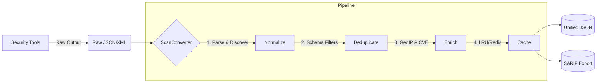

<div align="center">
  <h1>🚀 ScanConverter</h1>
  <p><b>The Ultimate Post-Processing Brain for Offensive Security Scans</b></p>
</div>

---

## 📖 Overview

**ScanConverter** is a highly dynamic, schema-driven data normalization, filtering, and auto-discovery engine. 

It is designed to be the central "Brain" for your security workflows. While you use various tools (Nmap, Nuclei, Httpx, Subfinder, etc.) to scan your targets, **ScanConverter** takes those raw, unstructured files, understands them, filters out the noise, enriches the data, and unifies them into a single, perfectly structured JSON format ready to be consumed by your Frontend UI or Database.

## ✨ Core Capabilities

ScanConverter is not just a parser; it is a full-fledged post-processing pipeline:

*   🧠 **Auto-Discovery Engine**: Don't have a schema for a new tool? Just pass the raw output file. The engine will automatically detect the tool, map the fields, and generate a Schema for you.
*   🛠️ **Zero-Code Tool Integration**: Support a new security tool entirely through a JSON/YAML schema file.
*   🎯 **Schema-Based Filtering**: Write dynamic `expr-lang` expressions directly in your schemas (e.g., `"port == 80 || port == 443"`).
*   🧹 **Advanced Deduplication**: Configurable finding deduplication using specific field hashing and smart result merging.
*   ⚡ **Enrichment Pipeline**: Automatically enriches findings with contextual data:
    *   **CVEEnricher**: Fetches and attaches CVSS scores and CVE details.
    *   **GeoIPEnricher**: Attaches IP geolocation data.
    *   **TechEnricher**: Identifies web technologies automatically.
*   💾 **Multi-Level Caching**: Built-in support for Redis and LRU Memory caching to instantly retrieve previous scan results.
*   🔌 **Plugin System**: Extend the engine using Go interfaces or **gRPC plugins** for complex custom tools.
*   📤 **SARIF Export**: Natively exports normalized results to the industry-standard SARIF format for CI/CD integrations.

---

## 🏗️ Architecture Workflow



---

## 🚀 Getting Started

### 1. Installation

```bash
git clone https://github.com/Ammar777782439/scanconverter.act
cd scanconverter
go mod tidy
go build -o scanconverter ./cmd/parse_file/
go build -o discover ./cmd/discover/
```

### 2. Usage as CLI

Parse a known tool's output to a unified format:
```bash
./scanconverter 
# Note: Ensure you edit main.go to point to your input file.
# Outputs: nmap_all.json
```

Use the **Auto-Discovery Engine** on an unknown tool's output:
```bash
./discover -file raw_output.jsonl -save
```

---

## 💻 Usage as a Go Library

ScanConverter provides massive flexibility when used inside your own Go Backend.

### The Ultimate Pipeline Example:

```go
package main

import (
	"context"
	"log"
	"os"

	"github.com/Ammar777782439/scanconverter/pkg/converter"
	"github.com/Ammar777782439/scanconverter/pkg/schema"
	"github.com/Ammar777782439/scanconverter/pkg/dedup"
	"github.com/Ammar777782439/scanconverter/pkg/enrich"
	"github.com/Ammar777782439/scanconverter/pkg/export"
	"go.uber.org/zap"
)

func main() {
	logger, _ := zap.NewProduction()

	// 1. Load schemas
	reg := schema.NewRegistry(logger)
	reg.LoadDir("./schemas")

	// 2. Initialize Converter
	conv := converter.NewConverter(reg, converter.WithLogger(logger))

	// 3. Setup Deduplication
	dedupEngine := dedup.NewDeduplicator(dedup.DefaultConfig())

	// 4. Setup Enrichment Pipeline (CVE + GeoIP + Tech)
	enrichPipeline := enrich.NewPipeline(logger).
		Add(enrich.CVEEnricher(enrich.DefaultCVEConfig(), logger)).
		Add(enrich.GeoIPEnricher(logger)).
		Add(enrich.TechEnricher())

	// -- Execute Pipeline -- //

	raw, _ := os.ReadFile("raw_results.json")
	
	// A. Convert & Filter (Based on Schema)
	result, _ := conv.Convert("nuclei", raw, "example.com", "job-123")

	// B. Deduplicate
	result = dedupEngine.Process(result)

	// C. Enrich
	result = enrichPipeline.Enrich(context.Background(), result)

	// D. Export to SARIF
	sarifExporter := export.NewSARIFExporter()
	sarifBytes, _ := sarifExporter.Export(result)
	os.WriteFile("results.sarif", sarifBytes, 0644)
}
```

---

## 🛠️ The Schema System

Schemas are the heart of ScanConverter. They map complex tool outputs to a unified model.

### Example Schema (`schemas/httpx.json`)
```json
{
  "name": "httpx",
  "version": "1.0",
  "format": "jsonl",
  "finding_type": "http",
  "fields": [
    { "name": "url", "path": "url" },
    { "name": "ip", "path": "host" },
    { "name": "port", "path": "port" }
  ],
  "filters": {
    "expressions": [
      "status_code == 200 || status_code == 301"
    ]
  }
}
```

### Supported Filter Variables
When writing `expressions`, you have access to the unified finding fields:
`type`, `target`, `ip`, `port`, `protocol`, `state`, `url`, `method`, `status_code`, `title`, `server`, `service`, `version`, `vuln_id`, `name`, `severity`, `cvss_score`, `hostname`.

**Helper Functions:**
- `contains(title, "Admin")`
- `matches(version, "^1\\.2\\.")`
- `in_cidr(ip, "192.168.1.0/24")`
