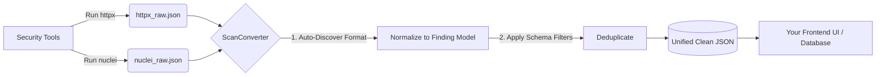

<div align="center">
  <h1>🚀 ScanConverter</h1>
  <p><b>The Ultimate Post-Processing Brain for Offensive Security Scans</b></p>
</div>

---

## 📖 Overview

**ScanConverter** is a highly dynamic, schema-driven data normalization, filtering, and auto-discovery engine. 

It is designed to be the central "Brain" for your security workflows. While you use various tools (Nmap, Nuclei, Httpx, Subfinder, etc.) to scan your targets, **ScanConverter** takes those raw, unstructured files, understands them, filters out the noise, and unifies them into a single, perfectly structured JSON format ready to be consumed by your Frontend UI or Database.

## ✨ Core Features

*   🧠 **Auto-Discovery Engine**: Don't have a schema for a new tool? Just pass the raw output file. The built-in AI-like engine will automatically detect the tool, map the fields, calculate confidence scores, and generate a ready-to-use Schema file for you.
*   🛠️ **Zero-Code Tool Integration**: Support a new security tool entirely through a JSON/YAML schema file. No need to recompile or write new Go code.
*   🎯 **Schema-Based Filtering**: Write dynamic expressions directly in your schemas (e.g., `"port == 80 || port == 443"` or `"severity in ['high', 'critical']"`). ScanConverter will automatically filter the output behind the scenes.
*   🧹 **Smart Deduplication**: Merges overlapping findings from different tools into a single, enriched finding.

---

## 🏗️ How it Fits into Your Workflow



---

## 🚀 Getting Started

### 1. Installation

```bash
git clone https://github.com/Ammar777782439/scanconverter.act
cd scanconverter
go mod tidy
go build -o scanconverter ./cmd/parse_file/
go build -o discover ./cmd/discover/
```

### 2. Usage as CLI

Parse a known tool's output (e.g., Nmap) to a unified JSON format:
```bash
./scanconverter 
# Note: Ensure you edit main.go to point to your input file, or modify it to accept arguments.
# Outputs: nmap_all.json
```

Use the **Auto-Discovery Engine** on an unknown tool's output:
```bash
./discover -file raw_output.jsonl -save
```
*This will analyze the file, extract the fields, print a confidence table, and save a new schema in `./schemas/`.*

### 3. Usage as a Go Library

ScanConverter is built to be easily embedded in your custom Backend/API:

```go
package main

import (
	"log"
	"os"

	"github.com/Ammar777782439/scanconverter/pkg/converter"
	"github.com/Ammar777782439/scanconverter/pkg/schema"
)

func main() {
	// 1. Load all tool schemas
	reg := schema.NewRegistry(nil)
	reg.LoadDir("./schemas")

	// 2. Initialize the converter
	conv := converter.NewConverter(reg)

	// 3. Read your raw tool output
	raw, _ := os.ReadFile("raw_nuclei_results.json")

	// 4. Convert, Normalize, and Filter automatically
	result, err := conv.Convert("nuclei", raw, "example.com", "job-123")
	if err != nil {
		log.Fatal(err)
	}

	// 'result' is now a perfectly structured models.ScanResult!
}
```

---

## 🛠️ The Schema System

Schemas are the heart of ScanConverter. They map complex tool outputs to a unified model.

### Example Schema (`schemas/httpx.json`)
```json
{
  "name": "httpx",
  "version": "1.0",
  "format": "jsonl",
  "finding_type": "http",
  "fields": [
    { "name": "url", "path": "url" },
    { "name": "ip", "path": "host" },
    { "name": "port", "path": "port" },
    { "name": "status_code", "path": "status_code" },
    { "name": "title", "path": "title" }
  ],
  "filters": {
    "expressions": [
      "status_code == 200 || status_code == 301"
    ]
  }
}
```

### Supported Filter Variables
When writing `expressions`, you have access to the unified finding fields:
`type`, `target`, `ip`, `port`, `protocol`, `state`, `url`, `method`, `status_code`, `title`, `server`, `service`, `version`, `vuln_id`, `name`, `severity`, `cvss_score`, `hostname`.

**Helper Functions:**
- `contains(title, "Admin")`
- `matches(version, "^1\\.2\\.")`
- `in_cidr(ip, "192.168.1.0/24")`

---

## 🎯 Next Steps & Roadmap
- [x] Core Parsing Engine
- [x] Zero-Code Schema System
- [x] Auto-Discovery Engine
- [x] Schema-embedded Filters (`expr-lang`)
- [ ] **HTTP Server / API Layer** (For direct Frontend integration)
- [ ] **DefectDojo Export Integration**
